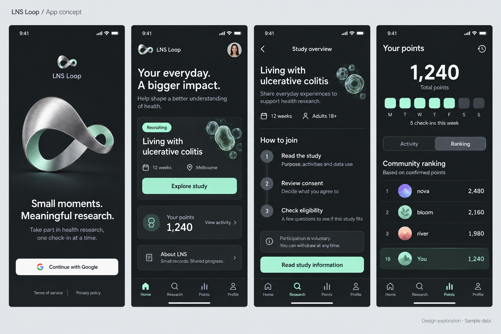

# LNS Loop 디자인 시스템

## 2026-09-21 실제 서비스 확장

기존 차콜·민트·실버 색상과 Loop 이미지는 유지한다. 운영 화면은 `apps/patient-mobile/src/loop/screens/`, 공통 토큰은 `src/loop/ui.tsx`이며 기존 `LoopPreview.tsx`는 보관된 시안이다. 하단 네이티브 도형 아이콘, 원형 주간 기여 카드, 포인트 세그먼트와 큰 총점 표시를 재사용한다. 주간 카드는 실제 승인된 제출 기록을 표시한다.

홈·연구·포인트·내 정보 4탭, 탭→상세 2단계, 연구 참여는 동의→적합성→건강앱 연결 과정으로 구성한다. 홈에서 제공 범위를 확인한 후 원터치 제출을 지원하며 상세 미리보기도 제공한다. Android/iPhone 데이터 연결은 각 플랫폼 명칭과 권한 차이를 표시한다. 한국어·영어, 48dp 버튼, 표준 뒤로가기와 입력 상태 보존을 적용한다. 운영 점수·랭킹은 서버 결과로 표시한다.

아래 2026-09-11 항목은 시각 기준 및 당시 프로토타입 상태 기록이다. 최신 기능 범위와 검증 결과는 `docs/implementation/service.md`를 따른다.

버전 1.0 · 2026-09-11 · 기준 구현 `cf5d541`

사용자가 승인한 차콜·민트·실버 시안과 이후 수정한 원형 출석 UI를 기준으로 한다. 이 문서는 현재 구현 수치와 앞으로 같은 화면을 확장할 때의 규칙을 구분해 기록한다. 과거 Pulse 네온·캡슐 시안보다 현재 앱 화면 디자인에 우선한다.

시안은 시각적 방향의 기준이다. 출석 카드는 아래 최신 명세를 따른다. 인물 사진·세포 그래픽·로고 등은 구현과 차이가 있다.

## 1. 디자인 방향

- **차분한 Web3 감각:** 차콜 바탕, 선명한 민트 액션, 넉넉한 여백, 크게 읽히는 숫자.
- **연구 참여 중심:** 연구 설명과 다음 행동이 먼저 읽히도록 구성한다. 포인트는 기여 현황으로 보여준다.
- **한 가지 강한 그래픽:** 실버 Loop 조형물은 로그인·프로젝트 소개에서 사용한다. 설문·동의 화면에는 장식을 늘리지 않는다.
- **일관된 깊이:** 카드 배경과 얇은 경계로 층을 구분한다. 반복적인 글로우, 강한 그림자, 유리 효과는 사용하지 않는다.
- **민트의 역할:** 주요 버튼, 선택, 완료, 현재 위치에 사용한다. 모든 문구를 민트로 강조하지 않는다.

## 2. 코드와 적용 범위

| 위치 | 역할 |
| --- | --- |
| [LoopPreview.tsx](../../apps/patient-mobile/src/features/preview/LoopPreview.tsx) | 현재 화면, 색상 `c`, 스타일 `s`, 공통 버튼·카드·아이콘 및 로컬 상태 |
| [app/index.tsx](../../apps/patient-mobile/app/index.tsx) | 현재 앱 진입점 |
| [loop.png](../../apps/patient-mobile/assets/brand/loop.png) | 실버·민트 Loop 이미지 |
| [MVP 기능 정리](../../docs/product/lns-loop-mvp-features.md) | 제품 범위와 후속 사용자 결정 |
| [검증 기록](../../docs/quality/screen-preview-2026-09-11.md) | 프로토타입 구현 및 확인 범위 |

React Native 스타일 숫자는 논리 단위이며 웹에서는 대체로 CSS px에 대응한다. 아래 토큰명은 현재 코드의 키를 그대로 따른다. 아직 독립된 컴포넌트 패키지나 테마 라이브러리는 아니다. 기존 `src/theme/`와 `src/components/ui/`는 Pulse용이며 새 화면의 기준 토큰으로 혼용하지 않는다.

## 3. 색상

| 코드 키 | 값 | 사용 |
| --- | --- | --- |
| `bg` | `#181C20` | 앱 배경, 민트·흰색 버튼 위 글자 |
| `surface` | `#242A2E` | 카드, 보조 버튼, 안내 박스 |
| `line` | `#384146` | 카드·목록 경계, 미완료 원 |
| `text` | `#F6F8F7` | 제목·주요 본문, Google 버튼 배경 |
| `muted` | `#ADB8BE` | 설명·보조 정보·비활성 탭 |
| `mint` | `#B8F4DA` | 주요 액션·완료·선택 강조 |
| `soft` | `#233C35` | 선택 배경, 내 순위, 출석 횟수 배지 |
| `outer` | `#E4E9EC` | 데스크톱 미리보기 바깥 배경만 |

추가 구현색: 선택 세그먼트 `#465057`, 연구 단계 원 `#414B52`. 아바타의 보라·살구·민트는 사람을 구분하는 장식이며 성공·실패의 의미가 없다. 실버는 이미지 소재이고 별도 금속 그라데이션 토큰은 없다.

## 4. 타이포그래피

현재 별도 폰트 파일이나 `fontFamily` 지정 없이 플랫폼 기본 sans-serif를 사용한다. 시안의 Manrope 같은 인상을 참고했지만 Manrope가 설치·적용된 상태는 아니다.

| 용도 / 스타일 | 크기 / 행간 | 굵기 | 자간 |
| --- | --- | --- | --- |
| 포인트 총점 `balanceValue` | 64 / 78 | 600 | -2.5 |
| 홈 제목 `homeTitle` | 34 / 41 | 600 | -1.2 |
| 로그인 제목 `loginTitle` | 30 / 37 | 600 | -0.9 |
| 포인트 요약 `summaryPoints` | 29 / 36 | 600 | 기본 |
| 연구 제목 `studyTitle` | 27 / 34 | 600 | -0.7 |
| 섹션 제목 `sectionTitle` | 23 / 30 | 600 | -0.5 |
| 행 제목 `rowTitle` | 16 / 24 | 500 | 기본 |
| 본문 `body` | 16 / 24 | 기본 | 기본 |
| 보조 문구 `small` | 13 / 20 | 기본 | 기본 |
| 하단 탭 `tabLabel` | 11 / 16 | 기본 | 기본 |

본문은 왼쪽 정렬한다. 로그인 소개와 포인트 총점은 가운데 정렬한다. 작은 11–12 크기는 탭·요일·배지에만 사용하고 연구 설명에는 쓰지 않는다. 긴 번역문이나 큰 시스템 글자에서는 고정 줄바꿈과 한 줄 배치를 다시 확인한다.

## 5. 레이아웃과 간격

- 앱 폭은 최대 430. 콘텐츠 좌우 24, 상단 18, 하단 28.
- 안전 영역은 `SafeAreaView`, 긴 본문은 `ScrollView`로 처리한다. 하단 탭은 스크롤 밖에 둔다.
- 웹 폭 600 이상에서는 중앙 모바일 프레임과 외부 미리보기 라벨을 표시한다. 프레임 높이는 `min(900, viewportHeight - 88)`, 모서리는 28이다.
- 일반 카드: 안쪽 17, 모서리 15, 테두리 1, 아래 간격 18. 포인트·출석 카드는 안쪽 16.
- 주요 단위는 4·8·12·16·24이며 현재 승인된 구현에는 17·18·22·26 같은 광학적 조정값도 있다. 문서화만을 이유로 일괄 보정하지 않는다.
- 새로운 화면도 제목 → 설명 → 내용 → 주요 액션 순서를 유지한다. 데이터 행마다 별도 카드를 만들지 말고 같은 목록 안에 정렬한다.

## 6. 컴포넌트

| 컴포넌트 | 현재 규격 | 상태와 사용 |
| --- | --- | --- |
| Primary button | 최소 높이 52, 안쪽 14, 모서리 11, 글자 16/600 | 민트 배경 + 차콜 글자. 화면의 다음 행동 |
| Secondary button | 동일 크기, surface 배경, line 테두리 1 | 수정·로그아웃 등 보조 행동 |
| Google button | 최소 높이 54, 모서리 12, 안쪽 12 | 흰색 배경. 현재 G는 임시 문자이며 실제 인증 전 공식 자산 적용 필요 |
| Card | surface, line 테두리 1, 모서리 15 | 관련 정보와 행동 묶음 |
| Row | 최소 높이 67, 안쪽 17, 요소 간격 13 | 아이콘·제목/설명·이동 표시 |
| Checkbox | 시각 크기 23, 모서리 5, 테두리 1.5 | 행 전체 클릭. 선택 시 민트 채움 + 체크. 기본 미선택 |
| Radio choice | 최소 높이 48, 안쪽 12, 모서리 8 | 하나만 선택. 선택 시 soft 배경·mint 테두리/글자 + 체크 |
| Segmented control | 외곽 모서리 12, 안쪽 3, 항목 최소 높이 44 | Activity / Ranking. 선택 배경 `#465057` |
| Bottom tabs | 4개 균등 배치, 항목 최소 높이 48 | Home / Research / Points / Profile. 선택은 mint |
| Ranking row | 최소 높이 72, 세로 16, 간격 14 | 순위·아바타·닉네임·우측 점수. 내 행은 soft 배경 |
| Notice | 안쪽 14, 모서리 12, 테두리 1 | 아이콘 + 읽기 쉬운 설명. 중요한 안내를 색상에만 맡기지 않음 |

버튼 눌림은 opacity 0.7, 비활성은 0.4와 실제 `disabled` 상태를 함께 적용한다. 비활성 버튼을 클릭해도 실행되지 않아야 한다. 로딩·오류·네트워크 재시도 상태는 아직 구현하지 않았으며 서버 연결 시 추가한다.

아이콘은 현재 네이티브 View로 만든 24×24 기하 도형이다. 아이콘 버튼의 터치 영역은 48×48. 후속 확장에서도 동일한 선 굵기와 외곽 크기를 유지한다. 임시 `∞` 로고를 정식 브랜드 마크로 오해하지 않는다.

## 7. 출석 카드 — 최신 승인 방향

사각형 요일 블록 대신 원형 체크를 사용한다. 위쪽 제목과 횟수 배지, 요일 7열, 상태 문구, 출석 버튼을 하나의 카드에 묶는다.

| 요소 | 규칙 |
| --- | --- |
| 헤더 | `Your weekly rhythm` + `4 / 7 days` 형태의 작은 횟수 배지 |
| 요일 | Mon–Sun, 7열 균등 배치, 열 간격 4, 라벨 11/500 |
| 원 | 최대 34, 정사각 비율, 둥근 테두리 |
| 완료 | 민트 채움 + 차콜 체크 |
| 오늘 미완료 | 민트 테두리 2 + 중앙 점 |
| 오늘 표시 | 해당 요일 아래 민트 점 4, 오늘 완료 후에도 유지 |
| 미완료/예정 | line 테두리 1 + muted 중앙 점 |
| 완료 후 | 안내 문구·횟수·체크가 함께 변경되고 버튼은 비활성 |

요일 원은 상태 표시이며 클릭 대상이 아니다. 액션은 `Check in today` 버튼 하나다. 스크린리더에는 요일·오늘 여부·체크 여부를 함께 전달한다.

**데모 한계:** 금요일을 오늘로 가정하고 월–목 4회 완료로 시작한다. 날짜·시간대·연속 출석 계산이 연결된 달력이 아니다. 실제 연결 시 서버 기준 날짜와 완료 기록에서 렌더링해야 한다. 출석으로 지급할 점수는 정하지 않았으며 현재 포인트를 올리지 않는다.

## 8. 화면별 구성과 인터랙션

- **로그인:** 브랜드 → 실버 Loop → 짧은 소개 → Google 버튼 → 약관 링크. 버튼은 더미 홈 진입.
- **홈:** 프로젝트 제목 → 연구 카드 → 포인트 요약 → 출석 → 설문·소개 진입.
- **연구:** 목적·기간·대상 → 설명·동의·적합성의 3단계 → 자발적 참여 안내 → 다음 버튼.
- **동의:** 개별 체크, 필수 항목 완료 시 다음 버튼 활성화. 의료기록 제공은 현재 데모에서 선택 항목. 최종 동의서나 연구 요건으로 확정된 것은 아니다.
- **적합성:** 질문별 Yes/No 단일 선택. 전체 응답 후 완료 안내. No를 선택했다고 임의의 임상 판정을 보여주지 않는다.
- **주간 설문:** 질문별 단일 선택 + 답변 확인 체크 → 완료 → 답변 보기·수정. 수정 시 답변은 유지하고 확인 체크를 해제한다.
- **포인트:** 총점 → 주간 출석 카드 → Activity/Ranking → 목록. 점수는 오른쪽으로 정렬한다.
- **프로필:** 아바타·계정 예시 → 총점·순위 → 연구·포인트·동의·설정 → 로그아웃.

현재 선택값은 메모리에만 유지된다. 새로고침하면 초기화된다. 실제 계정별 저장, 제출, 연구 참여, 적립을 수행하지 않는다. 프로필·점수·랭킹은 샘플이다.

## 9. 문구와 모션

영어 UI를 기본으로 짧고 직접적인 행동 문구를 사용한다: `Explore study`, `Check in today`, `Complete survey`. 문서와 운영 안내는 한국어로 작성해도 된다. 포인트는 점수·내역으로만 표현한다. 사용자 화면에 지갑·시세·에어드랍·토큰 전환·향후 배분 약속을 추가하지 않는다.

현재 앱에는 반복 모션이나 화면 전환 애니메이션이 없다. 후속 모션은 선택·완료 등 사용자 행동의 결과를 설명할 때만 추가하고, 시스템 모션 축소 설정을 따른다. 과거 Pulse의 네온 리본·호흡·캡슐 모션을 기본으로 가져오지 않는다.

## 10. 확장 시 확인할 사항

- 기존 공통 버튼·카드·색상 키를 우선 재사용한다. 현재 문서와 코드 수치가 바뀌면 함께 갱신한다.
- 375 폭, 작은 높이, 가로 화면, 큰 시스템 글자에서 잘림과 스크롤·고정 탭 겹침을 확인한다.
- 키보드 포커스 표시, checkbox/radio/tab의 접근성 상태, 버튼의 읽기 순서를 확인한다.
- 색뿐 아니라 체크·문구로 선택/완료를 구분한다. 본문 대비와 터치 영역은 변경 후 실제 검증한다.
- Google 공식 자산, 정식 로고, 서버 상태, 실제 연구 동의 문구는 별도 확정이 필요하다.
- 현재 웹 시각 확인·타입 검사를 접근성 인증이나 iOS/Android 실기기 검증 완료로 표현하지 않는다.

기준 변경 우선순위: 후속 사용자 결정 → 이 문서의 최신 규칙 → 승인 시안 → 과거 `design/`·Pulse 자료. 새 스타일을 만들기 전에 이 문서를 읽는다.
